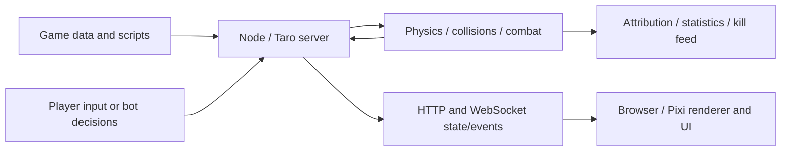

# Architecture and Combat

[ภาษาไทย](../th/architecture.md) · [Documentation](index.md)

## Data and runtime

`src/game.json` defines units, items, projectiles, attributes, map layers, controls and scripts. Parse it with Node `JSON.parse`: some exported keys differ only by case. It is distinct from the sibling exported-game repository.

The server executes game logic and authoritative combat. Client input travels through the networking layer; the browser renders entities and UI with Pixi and local browser libraries. Physics components handle bodies/collisions according to the configured backend. Client-side prediction/rendering is not itself permission to change server health or scores.

## Skills, damage and life cycle

Units hold attributes such as HP/resources, items and ability state. The ability/item path checks cooldown, costs and available actions; scripts can impose additional character-specific conditions. Projectile scripts, movement, collisions, area effects and summons can produce damage through different paths. A generic ready-to-fire decision does not model every custom skill perfectly.

When a tracked combat unit dies, life bookkeeping avoids duplicate death credit. Training/demo bots respawn according to the game/runtime schedule; the next life can use another character. Summoned units have their own entity lifecycle and are not automatically separate training participants.

## Attribution and statistics

`CombatAttribution` and combat event propagation preserve damage-source ownership/character information, including delayed projectiles. `TrainingStats` groups records by player and by player/character life history. It records actual HP loss; source damage credit applies to an enemy source, while target damage taken can include other causes.

- Duplicate health/death events are rejected by identifiers/life bookkeeping.
- A kill requires a valid opposing participant; self/team damage is not an enemy kill.
- Assists use recent contributing enemy damage within **10 seconds**, excluding the credited killer, when a valid kill is recorded.
- Source character IDs preserve credit when a projectile hits after its source changes character or dies, where the event carries that information.
- Weapon use and damage-hit events are separate; multiple hits can result from one use, so hits/use is not bullet accuracy.

## Desktop boundary

Electron starts its own server in a utility process, obtains local HTTP/WebSocket addresses, and configures the game window. Its request allowlist limits renderer network access to the owned local endpoints. Packaged resources contain gameplay and inference code, visual assets and policy seeds; training mutation tools and audio are excluded. Missing user policy seeds are copied without overwriting existing policies. Selection and logs live in per-user data.

## Limits

Custom scripted skills and ownership transfers need correct source metadata for complete attribution. Historical logs can reflect older implementations. Statistics alone cannot determine whether very low summon damage is a weak model, failed skill execution or missing attribution. The dodge planner cannot predict arbitrary future script behavior that is not exposed as a hazard.
