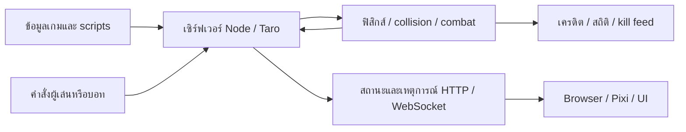

# โครงสร้างและการต่อสู้

[English](../en/architecture.md) · [สารบัญ](index.md)

## ข้อมูลและ runtime

`src/game.json` กำหนดยูนิต อาวุธ กระสุน attributes เลเยอร์แผนที่ controls และ scripts ควร parse ด้วย Node `JSON.parse` เพราะบาง key ต่างกันเพียงตัวพิมพ์ใหญ่–เล็ก ไฟล์นี้คนละชุดกับรีโปเกม export ข้างเคียง

เซิร์ฟเวอร์ดำเนินตรรกะเกมและตัดสินการต่อสู้จริง Input ของผู้เล่นผ่านระบบเครือข่าย Browser ใช้ Pixi และไลบรารีในเครื่องวาด entities/UI ฟิสิกส์จัดการ body/collision ตาม backend ที่ตั้งไว้ การคาดการณ์หรือวาดภาพฝั่ง client ไม่ใช่สิทธิ์แก้ HP/คะแนนบนเซิร์ฟเวอร์

## สกิล ดาเมจ และช่วงชีวิต

ยูนิตมี HP/ทรัพยากร items และสถานะ ability เส้นทาง ability/item ตรวจ cooldown ค่าใช้จ่ายและคำสั่งที่ใช้ได้ ส่วน script อาจมีเงื่อนไขเฉพาะตัวเพิ่มเติม การเคลื่อนที่ กระสุน collision พื้นที่ดาเมจและ summon ทำดาเมจได้คนละทาง คำสั่งยิงทั่วไปจึงไม่ได้แทนกลไกสกิลพิเศษได้สมบูรณ์ทุกตัว

เมื่อยูนิตผู้ร่วมต่อสู้ตาย ระบบช่วงชีวิตป้องกันเครดิตซ้ำ บอทฝึก/demo เกิดใหม่ตามตารางในเกม/runtime และชีวิตถัดไปอาจใช้ตัวละครอื่น Summon มีวงจร entity ของตัวเอง ไม่ได้ถูกนับเป็นผู้เข้าร่วมฝึกแยกโดยอัตโนมัติ

## เครดิตและสถิติ

`CombatAttribution` กับการส่งต่อ event รักษาข้อมูลเจ้าของและตัวละครผู้ทำดาเมจ รวมกระสุนที่ชนภายหลัง `TrainingStats` รวมข้อมูลระดับผู้เล่นและประวัติผู้เล่น/ตัวละคร บันทึก HP ที่ลดจริง ให้ดาเมจทำแก่แหล่งที่มาฝั่งศัตรู ขณะที่ดาเมจรับอาจรวมสาเหตุอื่น

- ปฏิเสธ event ลด HP/ตายซ้ำด้วย identifier และข้อมูลช่วงชีวิต
- Kill ต้องมาจากผู้ร่วมต่อสู้คนละทีมที่ถูกต้อง ดาเมจตนเองหรือทีมเดียวกันไม่ใช่ enemy kill
- Assist นับผู้ร่วมทำดาเมจศัตรูในช่วง **10 วินาที** ล่าสุด ยกเว้นผู้ได้ kill เมื่อมี kill ที่ถูกต้อง
- Character ID ต้นทางช่วยรักษาเครดิตเมื่อกระสุนชนหลังเปลี่ยนตัวหรือตาย หาก event มีข้อมูลต้นทางนั้น
- จำนวนใช้อาวุธแยกจากจำนวนเหตุการณ์ดาเมจ การใช้ครั้งเดียวอาจชนหลายครั้ง จึงใช้ hits/use เป็นความแม่นยำกระสุนไม่ได้

## ขอบเขต desktop

Electron เปิดเซิร์ฟเวอร์ของตัวเองผ่าน utility process รับที่อยู่ HTTP/WebSocket ในเครื่องและตั้งค่าหน้าต่างเกม Allowlist จำกัด renderer ให้เรียกเฉพาะ endpoint ท้องถิ่นที่โปรแกรมเป็นเจ้าของ Resources มี gameplay/inference ภาพและ seed policies แต่ไม่รวมเครื่องมือแก้ไขการฝึกหรือเสียง คัดลอก seed ที่ผู้ใช้ยังไม่มีโดยไม่ทับ policy เดิม ตัวเลือกและ log เก็บในข้อมูลรายผู้ใช้

## ข้อจำกัด

สกิล script และการเปลี่ยนเจ้าของต้องส่ง source metadata ถูกต้องจึงให้เครดิตครบ Logs เก่าอาจมาจากระบบเวอร์ชันก่อน สถิติดาเมจ summon ต่ำอย่างเดียวแยกไม่ได้ว่าโมเดลอ่อน สกิลไม่ทำงาน หรือเครดิตหาย Planner หลบกระสุนไม่คาดเดา script ในอนาคตที่ยังไม่เปิดเผยเป็น hazard
